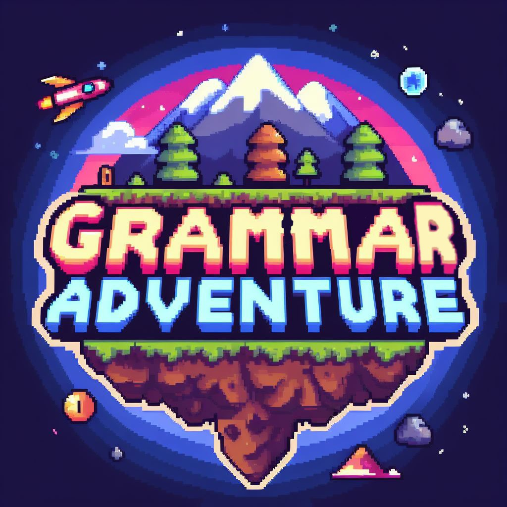

# 🎮 IndustrialQuest

🎓 Juego educativo interactivo desarrollado con Python y Pygame para aprender gramática inglesa de manera divertida 🎯📚. Cuenta con 4 capítulos temáticos (Simple Past, Comparatives, Present Perfect, Future) 📖⚡ con un sistema de puntuación progresivo 🏆, velocidad adaptativa 🚀 y retroalimentación inmediata por efectos de sonido 🎵. Posee una interfaz con estética pixel art retro 🎨 y mecánicas de juego tipo "typing game" 💨 optimizada para la mejora de habilidades lingüísticas 🌟.

<div align="center">



[](https://www.python.org/)
[](https://www.pygame.org/)
[](#licencia)
[](#)

[🎯 Características](#-características) • [🚀 Instalación](#-instalación) • [🎮 Cómo Jugar](#-cómo-jugar) • [📚 Temas](#-temas-disponibles) • [🛠️ Desarrollo](#️-desarrollo)

</div>

---

## 📋 Descripción

**IndustrialQuest** es un juego educativo desarrollado en Python con Pygame que ayuda a los estudiantes a perfeccionar sus conocimientos de gramática en inglés. El jugador debe completar frases con la palabra correcta que falta en cada oración antes de que estas se desplacen fuera de la pantalla.

### 🎯 Características

- 🎨 **Interfaz gráfica atractiva** con estilo retro pixel art.
- 🎵 **Efectos de sonido inmersivos** para respuestas correctas, fallos, menús y pantallas de estado.
- 📈 **Sistema de puntuación progresivo** con dificultad incremental.
- ❤️ **Sistema de vidas** con 3 corazones (oportunidades) por partida.
- 🎪 **4 capítulos temáticos** enfocados en distintas áreas gramaticales clave del inglés.
- ⚡ **Velocidad adaptativa** de caída de frases que se incrementa conforme aumenta el puntaje.
- 🏆 **Feedback inmediato** para potenciar el aprendizaje continuo.

---

## 🚀 Instalación

### Prerrequisitos

- Python 3.8 o superior.
- Administrador de paquetes de Python (`pip`).

### Pasos de instalación

1. **Clona el repositorio u obtén los archivos**
   ```bash
   git clone https://github.com/tu-usuario/industrial-quest.git
   cd industrial-quest
   ```

2. **Instala las dependencias necesarias**
   ```bash
   pip install pygame
   ```

3. **Ejecuta el juego**
   ```bash
   python IndustrialQuest.py
   ```

### 📦 Estructura del proyecto

El proyecto ha sido refactorizado con una arquitectura modular y limpia para facilitar su escalabilidad:

```text
IndustrialQuest/
├── IndustrialQuest.py            # Punto de entrada principal
├── fuentes/                      # Fuentes tipográficas retro
│   ├── Pixelletters-RLm3.ttf
│   └── Pixellettersfull-BnJ5.ttf
├── recursos/                     # Activos multimedia (imágenes y audios)
│   ├── *.png, *.jpg, *.wav
│   └── ...
├── src/                          # Módulos del motor y lógica
│   ├── constantes.py             # Configuración y valores globales
│   ├── datos_juego.py            # Base de datos de capítulos y frases
│   ├── administrador_recursos.py  # Carga y almacenamiento en caché de activos
│   ├── frase.py                  # Clase representativa de la entidad frase
│   ├── motor.py                  # Lógica del ciclo de juego (game loop) y estados
│   ├── pantalla.py               # Clase abstracta base para pantallas
│   ├── pantalla_menu.py          # Menú principal y animación del logo
│   ├── pantalla_reglas.py        # Visualización de instrucciones
│   ├── pantalla_niveles.py       # Menú de selección de capítulos
│   ├── pantalla_juego.py         # Lógica interna del gameplay activo
│   └── pantalla_fin.py           # Pantalla de Game Over
└── README.md                     # Este archivo
```

---

## 🎮 Cómo Jugar

### 🎯 Objetivo
Escribe y completa las oraciones en pantalla con la palabra gramaticalmente correcta antes de que la frase cruce el borde derecho.

### 🕹️ Controles
- **Teclado**: Escribe directamente la palabra que falta.
- **Retroceso (Backspace)**: Borra letras ingresadas.
- **ESC**: Sale de la partida actual al menú de selección / finalización.

### 📋 Reglas del juego

1. 📝 **Frases incompletas**: Aparecerá una frase con una palabra faltante representada por un guion bajo (`_`).
2. ⌨️ **Escritura activa**: Digita la respuesta correcta para sumar puntos.
3. 📈 **Progresión simultánea**: Conforme tu puntaje aumente, aparecerá un mayor número de frases flotando en pantalla.
4. ⚡ **Velocidad dinámica**: La velocidad del texto aumentará progresivamente de acuerdo con tu puntuación (`velocidad = 0.4 + puntuacion/50`).
5. 🚫 **Sin contracciones**: Se debe ingresar la forma completa de las palabras (ej. *will not* en lugar de *won't*).
6. ❤️ **Pérdida de vidas**: Si una frase escapa de la pantalla, perderás un corazón de vida.
7. 💀 **Fin de la partida**: Al perder los 3 corazones de vida, el juego terminará.

---

## 📚 Temas Disponibles

<details>
<summary><strong>🕐 Simple Past (Pasado Simple)</strong></summary>

- **Enfoque**: Verbos regulares e irregulares en tiempo pasado.
- **Ejemplos**: 
  - "She _ the tree (climb)" → "climbed"
  - "Mary _ off the tree (fall)" → "fell"
- **Dificultad**: ⭐⭐☆☆☆
</details>

<details>
<summary><strong>📊 Comparatives and Superlatives (Comparativos y Superlativos)</strong></summary>

- **Enfoque**: Adjetivos comparativos y superlativos.
- **Ejemplos**: 
  - "La Paz is _ _ Santa Cruz (cold)" → "colder than"
  - "Mt. Everest is _ _ mountain in the world (tall)" → "the tallest"
- **Dificultad**: ⭐⭐⭐☆☆
</details>

<details>
<summary><strong>✅ Present Perfect (Presente Perfecto)</strong></summary>

- **Enfoque**: Estructuras del presente perfecto con auxiliares *have/has* y participios.
- **Ejemplos**: 
  - "She _ _ to the movies (go)" → "has gone"
  - "I _ _ living in Bolivia this year (be)" → "have been"
- **Dificultad**: ⭐⭐⭐⭐☆
</details>

<details>
<summary><strong>🔮 Future with will / going to (Futuro)</strong></summary>

- **Enfoque**: Oraciones futuras utilizando *will* y la estructura *going to*.
- **Ejemplos**: 
  - "I _ _ _ to Bolivia next year (won't/go)" → "will not go"
  - "She is _ _ _ a new business (go/start)" → "going to start"
- **Dificultad**: ⭐⭐⭐⭐⭐
</details>

---

## 🛠️ Desarrollo

### 🔧 Tecnologías Utilizadas

- **Python 3.8+**: Lenguaje estructurado principal.
- **Pygame 2.0+**: Motor multimedia para el renderizado gráfico 2D e interacción de audios.
- **Pixel Art**: Gráficos y fondos temáticos retro.

### 🏗️ Arquitectura de Software

El videojuego ha sido reestructurado utilizando una arquitectura orientada a objetos basada en **Patrón de Estados (State Pattern)** mediante un Gestor de Pantallas:

- **MotorJuego**: Maneja el ciclo principal, el tiempo y la transición entre estados.
- **AdministradorRecursos**: Implementa una caché en memoria para las texturas e instrumentos sonoros.
- **FraseJuego**: Entidad independiente con soporte de conversión y lectura polimórfica.
- **Pantalla**: Plantilla abstracta para las diferentes fases del menú y del juego.

---

## 🤝 Contribuir

Si deseas proponer mejoras al juego:

1. Realiza un Fork del proyecto.
2. Crea una rama para tu característica (`git checkout -b feature/AmazingFeature`).
3. Realiza commit de tus cambios (`git commit -m 'Añadir nueva mejora'`).
4. Haz Push a la rama (`git push origin feature/AmazingFeature`).
5. Abre un Pull Request.

---

## 📝 Licencia

Este proyecto se distribuye bajo la Licencia MIT. Consulta el archivo `LICENSE` para más detalles.
