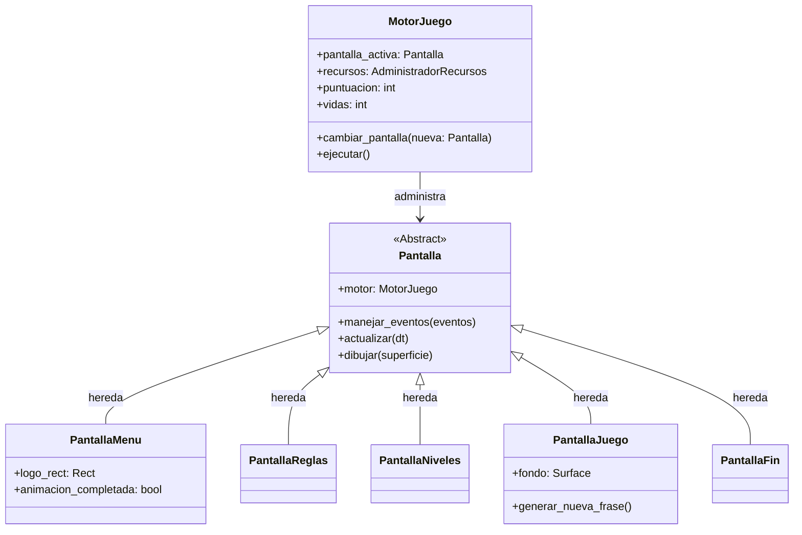

# Arquitectura del Proyecto

**IndustrialQuest** está construido sobre una arquitectura orientada a objetos modular basada en el **Patrón de Estados (State Pattern)**. Esta estructura desacopla por completo la visualización y las reglas particulares de cada escena del ciclo del bucle principal del motor.

## Patrón de Estados (Screen Manager)

El motor gráfico mantiene una referencia a la pantalla activa. Esta pantalla procesa eventos, actualiza su estado interno y se dibuja sobre la superficie principal en cada iteración del bucle del juego.

## Componentes Principales

### 1. Núcleo (`src/motor.py`)
La clase `MotorJuego` es el punto neurálgico del software. Inicializa Pygame, configura la resolución de la ventana, crea el reloj controlador de frames, e inicializa los parámetros compartidos como las vidas, el tiempo de inicio de la partida y el récord de puntuación. Además, expone métodos como `cambiar_pantalla(nueva)` y `salir()`.

### 2. Gestión de Activos (`src/administrador_recursos.py`)
La clase `AdministradorRecursos` carga bajo demanda (Lazy Loading) y guarda en memoria caché las texturas e imágenes (`obtener_imagen(nombre)`) y los fragmentos sonoros (`obtener_sonido(nombre)`). Resuelve internamente la distribución en subcarpetas de recursos sin afectar al llamador.

### 3. Modelo de Entidades (`src/frase.py`)
La clase `FraseJuego` encapsula el texto de la pregunta, la respuesta esperada, la posición `(x, y)` de caída y el color RGB aleatorio. Implementa métodos mágicos (`__getitem__`, `__setitem__`) para actuar como un diccionario tradicional, garantizando la compatibilidad con código antiguo y simplificando el acceso a atributos en código moderno.

### 4. Estructura de Pantallas (`src/pantalla.py`)
Funciona como una plantilla abstracta. Define el contrato mínimo (`manejar_eventos`, `actualizar`, `dibujar`) que deben implementar las pantallas hijas para acoplarse dinámicamente al ciclo de vida del motor.
- **`pantalla_menu.py`**: Presenta el logo deslizante y el acceso a niveles.
- **`pantalla_reglas.py`**: Instrucciones estáticas del juego.
- **`pantalla_niveles.py`**: Selector dinámico de capítulos de estudio.
- **`pantalla_juego.py`**: Escena de juego activa.
- **`pantalla_fin.py`**: Escena de Game Over.
